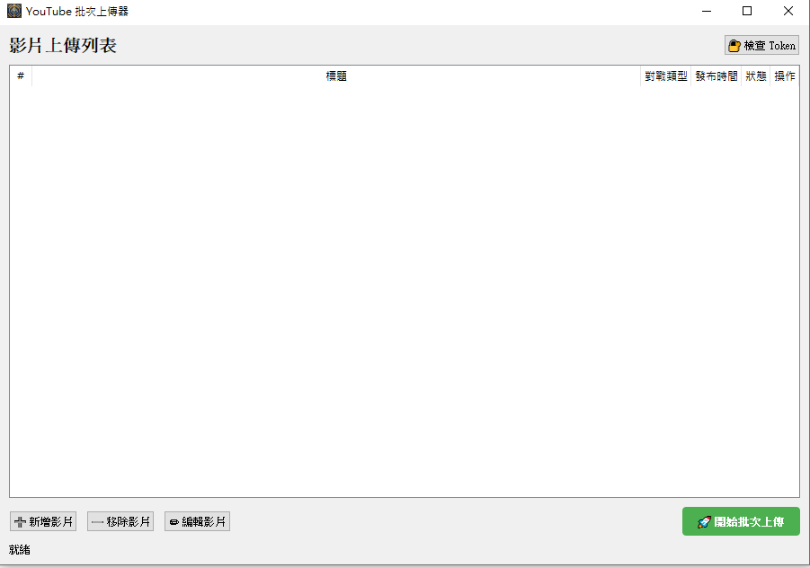

# 🎬 YouTube 批次上傳器

基於 PyQt5 開發的 YouTube 影片批次上傳工具，專為 StarCraft II 遊戲影片設計，支援自動上傳 Replay 到 Google Drive、多國語言標題、預約發布等功能。



## ✨ 功能特色

### 🚀 核心功能
- **批次上傳**：一次上傳多部影片，自動處理佇列
- **預約發布**：設定影片的發布時間
- **自動縮圖**：上傳自訂縮圖
- **播放清單**：自動加入指定的播放清單
- **Replay 上傳**：自動上傳 SC2 Replay 檔案到 Google Drive 並在描述中附上連結

### 🌍 多國語言支援
- 自動生成英文、繁體中文、日文、韓文標題
- 多語言描述自動翻譯種族名稱

### 🔐 Token 管理
- 統一管理 YouTube 和 Google Drive 的 OAuth Token
- Token 過期自動刷新
- 一鍵檢查 Token 狀態

## 📁 專案結構

```
YoutubeUpload/
├── main.py                 # 主程式入口
├── token_manager.py        # OAuth Token 統一管理
├── video_item.py           # 影片資料模型
├── UploadGoogleDrive.py    # Google Drive 上傳
├── dialogs/                # UI 對話框
│   ├── token_status_dialog.py    # Token 狀態檢查對話框
│   └── video_editor_dialog.py    # 影片編輯對話框
├── uploaders/              # 上傳器模組
│   ├── base_uploader.py          # 上傳器抽象基類
│   ├── youtube_uploader.py       # YouTube 上傳實作
│   └── bilibili_uploader.py      # B站上傳 (預留)
└── requirements.txt        # 依賴套件
```

## 🛠️ 安裝

### 1. 安裝依賴

```bash
pip install -r requirements.txt
```

### 2. 設定 Google Cloud Console

1. 前往 [Google Cloud Console](https://console.cloud.google.com/)
2. 建立新專案或選擇現有專案
3. 啟用 **YouTube Data API v3** 和 **Google Drive API**
4. 建立 OAuth 2.0 憑證，下載 JSON 檔案並命名為 `token.json`
5. 將 `token.json` 放在專案根目錄

### 3. 執行程式

```bash
python main.py
```

## 📦 打包為執行檔

使用 PyInstaller 打包：

```bash
# 安裝 PyInstaller
pip install pyinstaller

# 打包成單一執行檔
pyinstaller --onefile --windowed --icon=icon.jpg --name=YoutubeUploader main.py
```

打包後的執行檔在 `dist/YoutubeUploader.exe`

> ⚠️ **注意**：執行 `.exe` 時需要將 Token 檔案放在同目錄下

## 📋 使用說明

### 1. 檢查 Token 狀態
點擊右上角的「🔐 檢查 Token」按鈕，確認 YouTube 和 Google Drive 的認證狀態。

### 2. 新增影片
點擊「➕ 新增影片」，填寫：
- 影片檔案路徑
- 標題
- 縮圖（可選）
- Replay 檔案（可選）
- 發布時間
- 播放清單

### 3. 開始上傳
確認影片列表後，點擊「🚀 開始批次上傳」。

## 🔧 播放清單設定

在 `uploaders/youtube_uploader.py` 中的播放清單 ID 對應：

| 對戰類型 | 播放清單 |
|----------|----------|
| PVP | SC2 神族內戰 |
| PVZ | SC2 神族 vs 蟲族 |
| PVT | SC2 神族 vs 人族 |

## 📄 影片描述格式

上傳的影片描述會自動包含：

```
#starcraft2 #星海爭霸2 #gaming
【星海爭霸2】影片標題
RP : https://drive.google.com/...

Paypal斗內連結 
https://www.paypal.com/paypalme/...
歐富寶斗內連結 
https://payment.opay.tw/...
Facebook_粉絲團 
https://www.facebook.com/...
Instagram粉絲團 
https://www.instagram.com/...
Thread粉絲團 
https://www.threads.com/...
加入Nzs的頻道會員神族一起偉大 
https://www.youtube.com/...
記得幫我按讚訂閱開啟小鈴鐺
感謝大家~~
```

## 📝 依賴套件

```
PyQt5>=5.15.0
google-api-python-client>=2.0.0
google-auth>=2.0.0
google-auth-oauthlib>=0.5.0
google-auth-httplib2>=0.1.0
httplib2>=0.20.0
oauth2client>=4.1.3
```

## 🤝 貢獻

歡迎提交 Issue 和 Pull Request！

## 📜 授權

MIT License

---

> 開發者：[Cia Shang Lin](https://github.com/CiaShangLin)  
> 專為 SC2 實況主設計 🎮
