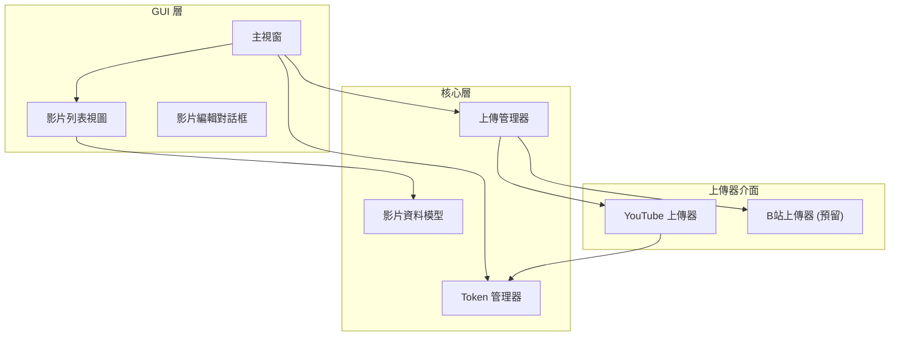

# YouTube 上傳器批次功能改版計畫

## 需求摘要

將現有單一影片上傳工具升級為支援批次上傳的版本，加入 Token 過期檢查，優化認證管理，並預留 B站上傳介面。

---

## 架構設計

### 模組化架構



---

## 提議的變更

### 核心模組

#### [NEW] [token_manager.py](file:///Users/tsaishanglin/Documents/vscode/YoutubeUpload/token_manager.py)

統一管理所有 OAuth Token，提供：
- Token 過期檢查
- 自動刷新機制
- Token 狀態報告

```python
class TokenManager:
    """統一的 Token 管理器"""
    
    def check_all_tokens(self) -> dict:
        """檢查所有 token 狀態，返回狀態報告"""
        
    def refresh_token(self, token_type: str) -> bool:
        """刷新指定類型的 token"""
        
    def get_youtube_upload_credentials(self):
        """取得 YouTube 上傳用憑證"""
        
    def get_youtube_ssl_credentials(self):
        """取得 YouTube SSL 憑證"""
        
    def get_google_drive_credentials(self):
        """取得 Google Drive 憑證"""
```

**Token 優化建議：**
- 使用 `google-auth` + `google-auth-oauthlib` 取代舊版 `oauth2client`（已棄用）
- 統一使用 pickle 格式儲存，方便管理過期時間
- 加入自動刷新 retry 機制

---

#### [NEW] [video_item.py](file:///Users/tsaishanglin/Documents/vscode/YoutubeUpload/video_item.py)

影片資料模型，封裝單一影片的所有資訊：

```python
@dataclass
class VideoItem:
    video_path: str           # 影片檔案路徑
    thumbnail_path: str       # 縮圖路徑
    replay_path: str          # RP 檔案路徑
    title: str                # 標題
    description: str          # 描述
    publish_time: datetime    # 預定發布時間
    playlists: List[str]      # 播放清單 ID 列表
    match_type: str           # 對戰類型 (PVP/PVZ/PVT)
    status: UploadStatus      # 上傳狀態
    
class UploadStatus(Enum):
    PENDING = "待上傳"
    UPLOADING = "上傳中"
    COMPLETED = "已完成"
    FAILED = "失敗"
```

---

#### [NEW] [upload_manager.py](file:///Users/tsaishanglin/Documents/vscode/YoutubeUpload/upload_manager.py)

批次上傳管理器：

```python
class UploadManager:
    """批次上傳管理器"""
    
    def __init__(self, token_manager: TokenManager):
        self.uploaders: Dict[str, BaseUploader] = {}
        self.register_uploader("youtube", YouTubeUploader())
        # self.register_uploader("bilibili", BilibiliUploader())  # 預留
    
    def upload_batch(self, videos: List[VideoItem], 
                     platform: str = "youtube",
                     progress_callback=None):
        """批次上傳影片"""
        
    def register_uploader(self, name: str, uploader: BaseUploader):
        """註冊上傳器（支援擴展）"""
```

---

#### [NEW] [uploaders/base_uploader.py](file:///Users/tsaishanglin/Documents/vscode/YoutubeUpload/uploaders/base_uploader.py)

上傳器抽象基類（預留 B站介面）：

```python
from abc import ABC, abstractmethod

class BaseUploader(ABC):
    """上傳器基類"""
    
    @abstractmethod
    def upload(self, video: VideoItem) -> str:
        """上傳影片，返回影片 ID"""
        pass
    
    @abstractmethod
    def set_thumbnail(self, video_id: str, thumbnail_path: str):
        """設定縮圖"""
        pass
    
    @abstractmethod
    def add_to_playlist(self, video_id: str, playlist_ids: List[str]):
        """加入播放清單"""
        pass
```

---

#### [NEW] [uploaders/youtube_uploader.py](file:///Users/tsaishanglin/Documents/vscode/YoutubeUpload/uploaders/youtube_uploader.py)

YouTube 上傳器實作（從 main.py 重構）：

```python
class YouTubeUploader(BaseUploader):
    """YouTube 上傳器"""
    
    def __init__(self, token_manager: TokenManager):
        self.token_manager = token_manager
        
    def upload(self, video: VideoItem) -> str:
        # 從 main.py 移植的上傳邏輯
        pass
```

---

#### [NEW] [uploaders/bilibili_uploader.py](file:///Users/tsaishanglin/Documents/vscode/YoutubeUpload/uploaders/bilibili_uploader.py)

B站上傳器（預留介面）：

```python
class BilibiliUploader(BaseUploader):
    """B站上傳器 - 預留介面"""
    
    def upload(self, video: VideoItem) -> str:
        raise NotImplementedError("B站上傳功能尚未實作")
```

---

### GUI 層

#### [MODIFY] [main.py](file:///Users/tsaishanglin/Documents/vscode/YoutubeUpload/main.py)

重構主視窗 UI：

**新增元件：**
- 影片列表 (`QTableWidget`) - 顯示待上傳的影片清單
- 新增影片按鈕 - 開啟影片編輯對話框
- 移除影片按鈕 - 從列表移除選中項目
- 檢查 Token 按鈕 - 顯示 Token 狀態對話框
- 批次上傳按鈕 - 開始批次上傳
- 進度顯示 - 顯示上傳進度

**UI 佈局示意：**

```
┌─────────────────────────────────────────────────────────────┐
│  [檢查 Token]                                               │
├─────────────────────────────────────────────────────────────┤
│  影片列表                                                    │
│  ┌─────────────────────────────────────────────────────────┐│
│  │ # │ 標題              │ 類型  │ 發布時間      │ 狀態    ││
│  │ 1 │ 【SC2】Nzs vs... │ PVZ  │ 2024-01-01   │ 待上傳  ││
│  │ 2 │ 【SC2】Nzs vs... │ PVT  │ 2024-01-02   │ 待上傳  ││
│  └─────────────────────────────────────────────────────────┘│
│  [➕ 新增影片]  [➖ 移除影片]  [✏️ 編輯]                      │
├─────────────────────────────────────────────────────────────┤
│  上傳進度: ████████░░░░░░░░ 50% (1/2)                        │
│                                              [開始批次上傳]  │
└─────────────────────────────────────────────────────────────┘
```

---

#### [NEW] [dialogs/video_editor_dialog.py](file:///Users/tsaishanglin/Documents/vscode/YoutubeUpload/dialogs/video_editor_dialog.py)

影片編輯對話框（保留原有的單一影片編輯功能）：

```
┌─────────────────────────────────────────────┐
│  影片編輯                                    │
├─────────────────────────────────────────────┤
│  [選擇檔案] /path/to/video.mp4             │
│  [選擇縮圖] /path/to/thumbnail.jpg         │
│  [選擇 RP]  /path/to/replay.SC2Replay      │
│                                             │
│  遊戲名稱: [StarCraft II        ]           │
│  發布時間: [2024-01-15 18:00    ]           │
│                                             │
│  播放清單: ☑ SC2天梯 ☐ PVP ☑ PVZ ☐ PVT     │
│  字幕語言: ☑ 英文 ☑ 中文                    │
│                                             │
│  標題:                                      │
│  ┌─────────────────────────────────────────┐│
│  │ 【StarCraft II】Nzs vs Opponent...     ││
│  └─────────────────────────────────────────┘│
│                                             │
│                    [取消]  [確定]            │
└─────────────────────────────────────────────┘
```

---

#### [NEW] [dialogs/token_status_dialog.py](file:///Users/tsaishanglin/Documents/vscode/YoutubeUpload/dialogs/token_status_dialog.py)

Token 狀態檢查對話框：

```
┌─────────────────────────────────────────────┐
│  Token 狀態檢查                              │
├─────────────────────────────────────────────┤
│  ✅ YouTube 上傳 Token                       │
│     有效期至: 2024-01-20 15:30              │
│                                             │
│  ⚠️ YouTube SSL Token                        │
│     已過期: 2024-01-10 12:00                │
│     [🔄 重新認證]                            │
│                                             │
│  ✅ Google Drive Token                       │
│     有效期至: 2024-01-25 18:00              │
│                                             │
│                              [關閉]          │
└─────────────────────────────────────────────┘
```

---

## 檔案結構

```
YoutubeUpload/
├── main.py                    # [MODIFY] 主視窗 (簡化為列表管理)
├── token_manager.py           # [NEW] Token 統一管理
├── video_item.py              # [NEW] 影片資料模型
├── upload_manager.py          # [NEW] 批次上傳管理
├── UploadGoogleDrive.py       # [MODIFY] 整合到 token_manager
├── UploadArgs.py              # [KEEP] 保留相容性
├── ReadGoogleDrive.py         # [KEEP] 工具程式
├── dialogs/
│   ├── __init__.py
│   ├── video_editor_dialog.py # [NEW] 影片編輯對話框
│   └── token_status_dialog.py # [NEW] Token 狀態對話框
├── uploaders/
│   ├── __init__.py
│   ├── base_uploader.py       # [NEW] 上傳器基類
│   ├── youtube_uploader.py    # [NEW] YouTube 上傳器
│   └── bilibili_uploader.py   # [NEW] B站上傳器 (預留)
└── token.json                 # OAuth 憑證設定
```

---

## Token 優化方案

### 現有問題

| Token 檔案 | 目前方式 | 問題 |
|-----------|---------|------|
| `login_token.json` | oauth2client (棄用) | 無自動刷新，一週過期 |
| `upload_token.json` | oauth2client (棄用) | 無自動刷新，一週過期 |
| `google_drive_token.pickle` | google-auth | ✅ 已有刷新機制 |

### 優化方案

1. **統一使用 `google-auth` 庫**：取代已棄用的 `oauth2client`
2. **合併 Token 儲存**：YouTube 的兩個 scope 可以合併為一個 token
3. **統一過期檢查**：透過 `TokenManager` 集中管理
4. **自動刷新**：使用 `refresh_token` 自動刷新過期的 access token

```python
# 建議的統一 SCOPE
SCOPES = [
    'https://www.googleapis.com/auth/youtube.upload',
    'https://www.googleapis.com/auth/youtube.force-ssl',
    'https://www.googleapis.com/auth/drive.file'
]
```

---

## 驗證計畫

### 自動測試
- 執行程式確認 GUI 正常顯示
- Token 檢查功能測試
- 影片列表新增/移除功能測試

### 手動驗證
- 實際上傳一部測試影片到 YouTube (設為私人)
- 確認縮圖、播放清單、多語言功能正常
- 批次上傳 2-3 部影片驗證佇列功能

---

## 實作優先順序

1. **Phase 1**: Token 管理器 + 過期檢查 UI
2. **Phase 2**: 影片資料模型 + 列表 UI
3. **Phase 3**: 重構上傳邏輯為 YouTubeUploader
4. **Phase 4**: 批次上傳管理器
5. **Phase 5**: 預留 B站介面

---

> [!IMPORTANT]
> 此計畫需要您的確認後才會開始實作。如有任何調整需求請告知！
